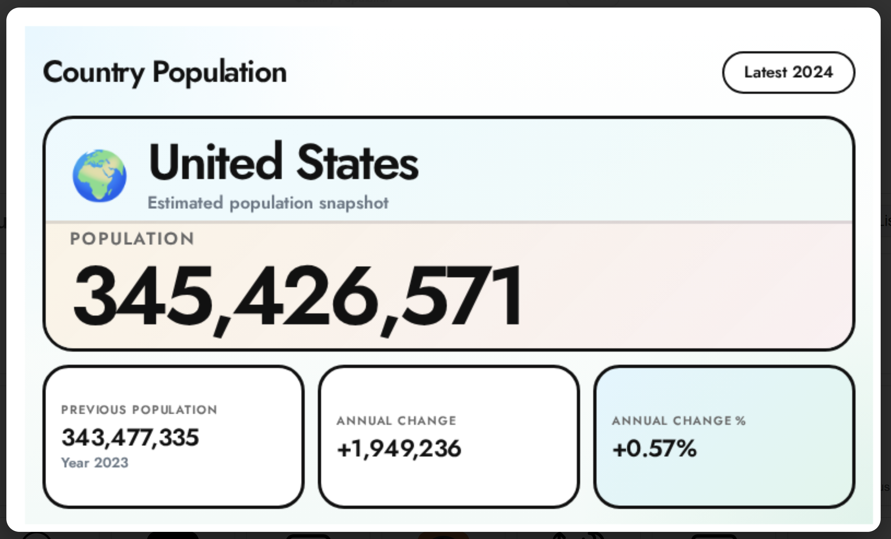
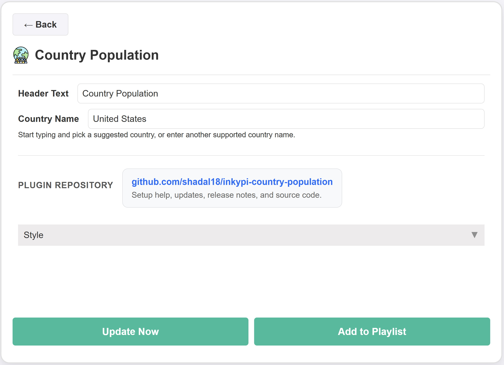

# InkyPi Country Population

An InkyPi plugin that shows country population data with a clean layout and configurable country settings.

## Install

Use the InkyPi plugin installer with the plugin ID and this repository URL, following the install pattern shown by the official InkyPi plugin template.

```bash
inkypi plugin install country_population https://github.com/shadal18/inkypi-country-population-data
```

## Update

To update the plugin on your InkyPi device:

1. SSH into your InkyPi host.
2. Change into the plugin directory:
   ```bash
   cd ~/InkyPi/src/plugins/country_population
   ```
3. Run this update command:
   ```bash
   git pull origin main && \
   if [ -d country_population ]; then \
     rsync -a country_population/ ./ && \
     rm -rf country_population; \
   fi && \
   sudo systemctl restart inkypi.service
   ```

If you don’t see your changes after updating:

- Confirm you are in the correct plugin folder.
- Clear your browser cache or hard refresh the InkyPi web UI.
- Check the InkyPi logs for any plugin errors.

## Requirements

- An API Ninjas account with a configured API key for population requests.
- A valid InkyPi environment key named `API_NINJAS_KEY`.
- Network access from the InkyPi device to the API Ninjas API endpoint.

## Features

This plugin is an extension for the InkyPi e-paper display frame and includes the following features.

- Shows the latest available population value for a configured country
- Displays the country name in a large, glanceable format
- Displays the reference year for the latest population entry
- Shows annual change data when a previous historical record is available
- Clean layout optimized for quick glance reading on e-paper
- Simple settings with a configurable header text and country name

## Settings

The plugin settings page lets you customize:

- Header text.
- Country name.

## API Key Setup

This plugin requires one API key from API Ninjas.

### Create the API key

1. Create or log into your API Ninjas account at [https://api-ninjas.com](https://api-ninjas.com).
2. Open your API Ninjas dashboard.
3. Generate or copy your API key for use with the [Population API](https://api-ninjas.com/api/population).

### Add the key in InkyPi

1. Open the InkyPi front page.
2. Click the **key icon**.
3. Add a new key named `API_NINJAS_KEY`.
4. Paste in your API Ninjas API key.
5. Save it.
6. Restart InkyPi if needed.

## API Endpoint Used

This plugin currently reads data from the following API Ninjas endpoint:

- `/v1/population`

This endpoint provides historical, current, and projected population statistics for countries around the world.

## Repository

GitHub repository:

[https://github.com/shadal18/inkypi-country-population-data](https://github.com/shadal18/inkypi-country-population-data)

## Screenshots

- Main plugin display showing country population data.
- Plugin settings screen.

<p align="center">
  
  
</p>
